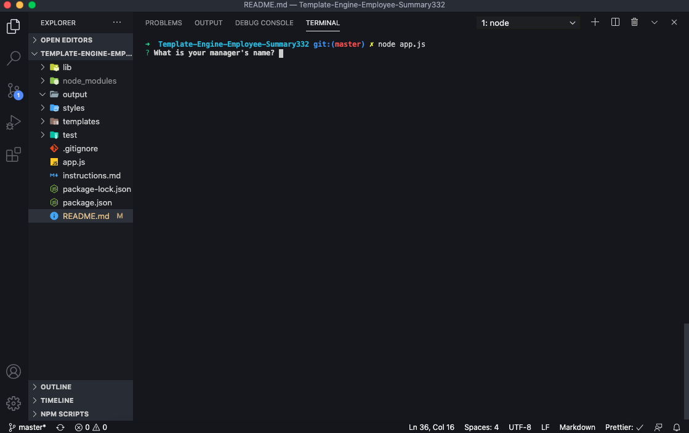
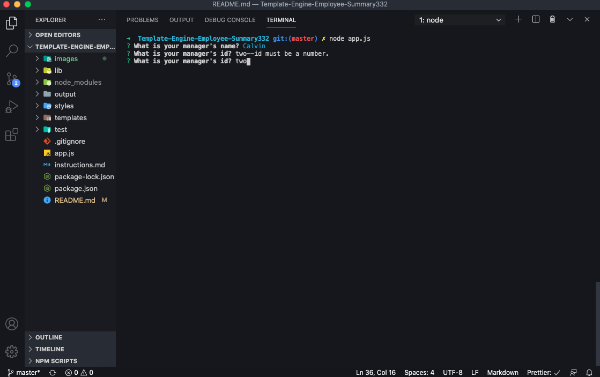
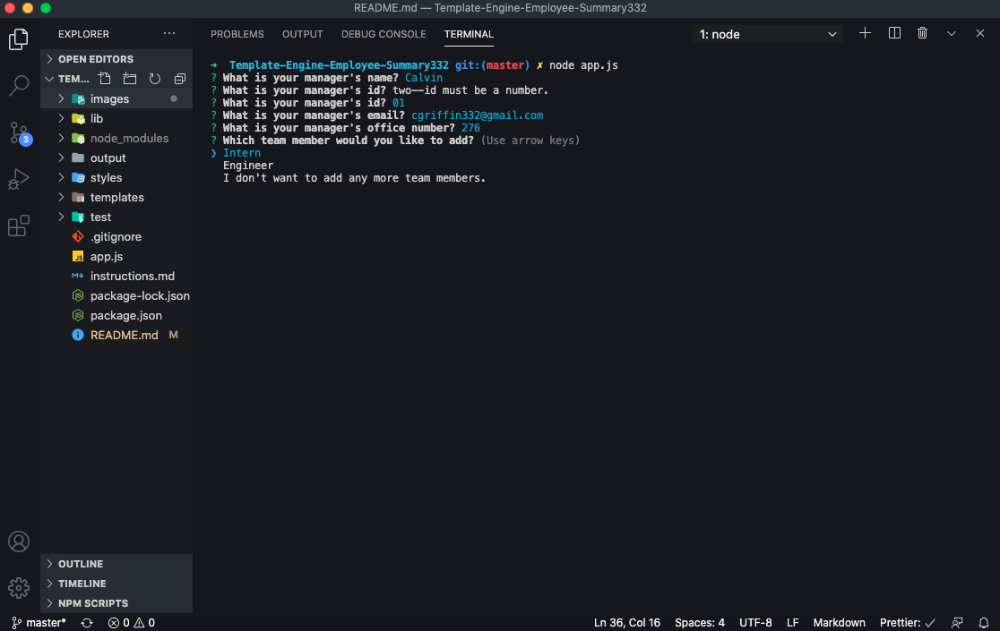
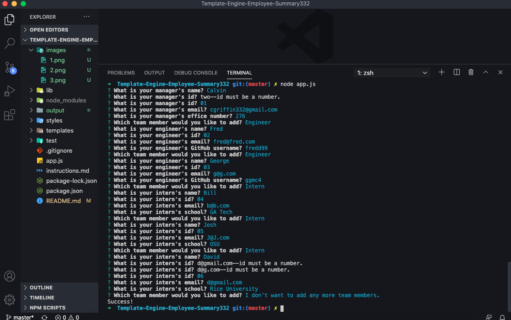
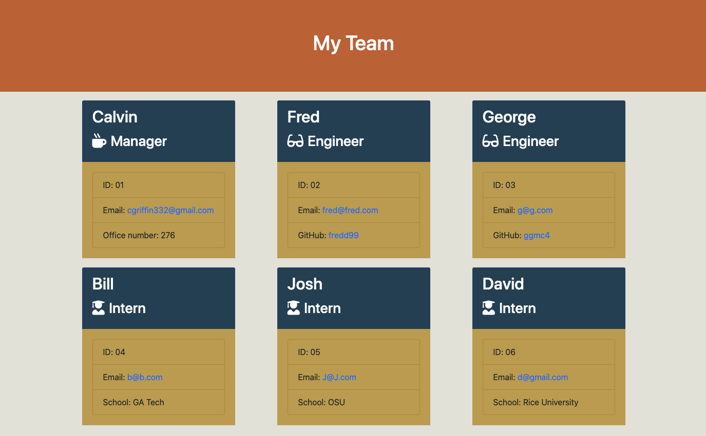

# Template-Engine-Employee-Summary332

## Description

In this project I have created a command line application used to build a programming team based on user input that will then create an html file including the team roster. This application was built through test oriented programming using the npm package, jest. The user is prompted to answer a number of questions based on the type of employee being created, and does this with the npm package, inquirer. 

## Table of Contents

* [Installation](#installation)
* [Usage](#usage)
* [License](#license)
* [Contributing](#Contributing)
* [Tests](#tests)
* [Questions](#questions)

## Installation

The user will need to clone the necesarry files from this project's GitHub repo, then run npm install in the terminal. Once that is finished, all that is left is to run the code "node app.js".

## Usage

Once the user has started the application by running "node app.js", they will be prompted to answer questions in the terminal. 

Certain validations are set in place to insure that the users answers are acceptable. 

Once the user finishes answering the manager questions, they are able to pick the next type of employee they would like to add to their team. 

This process continues until the user decides that they no longer wish to add more employees. 

An html file is then dynamically generated including each member of your new team.

## License

This project is covered under the MIT License.  
Copyright (c) [2020] [Calvin Griffin]  
Permission is hereby granted, free of charge, to any person obtaining a copy of this software and associated documentation files (the "Software"), to deal in the Software without restriction, including without limitation the rights to use, copy, modify, merge, publish, distribute, sublicense, and/or sell copies of the Software, and to permit persons to whom the Software is furnished to do so, subject to the following conditions:
The above copyright notice and this permission notice shall be included in all copies or substantial portions of the Software.
THE SOFTWARE IS PROVIDED "AS IS", WITHOUT WARRANTY OF ANY KIND, EXPRESS OR IMPLIED, INCLUDING BUT NOT LIMITED TO THE WARRANTIES OF MERCHANTABILITY, FITNESS FOR A PARTICULAR PURPOSE AND NONINFRINGEMENT. IN NO EVENT SHALL THE AUTHORS OR COPYRIGHT HOLDERS BE LIABLE FOR ANY CLAIM, DAMAGES OR OTHER LIABILITY, WHETHER IN AN ACTION OF CONTRACT, TORT OR OTHERWISE, ARISING FROM, OUT OF OR IN CONNECTION WITH THE SOFTWARE OR THE USE OR OTHER DEALINGS IN THE SOFTWARE.

## Contributing

If you would like to contribute, please contact me via email or GitHub.

## Tests

All of the projects tests are found in the test folder. If you would like to run these tests, simply run the command "npm run test".

## Questions

If you have any additional questions, please contact me via email or GitHub by clicking the links below.

Email: cgriffin332@gmail.com  
GitHub: https://github.com/cgriffin332
